# iocp-http-runtime

Windows IOCP 위에 전송 계층부터 HTTP/1.1 요청 처리까지 직접 조립한 C++17 서버 런타임입니다.

프레임워크를 대체하려는 프로젝트라기보다, 비동기 I/O에서 발생하는 객체 수명, 실행 문맥,
스트림 파싱, backpressure, 종료 순서를 코드로 확인하기 위한 학습용 구현입니다.

## Demo

```powershell
.\build\windows-debug\iocp_http_server.exe --config config\http_server.toml
```

```powershell
curl.exe http://127.0.0.1:8080/health
# {"status":"ok"}

curl.exe -X POST http://127.0.0.1:8080/echo `
  -H "Content-Type: text/plain" `
  --data-binary "hello IOCP"
# hello IOCP
```

기본 라우트:

| Method | Path | Description |
| --- | --- | --- |
| `GET` | `/` | 서비스와 endpoint 목록 |
| `GET` | `/health` | 서버 상태 확인 |
| `POST` | `/echo` | 요청 body 반환 |

## Architecture

```mermaid
flowchart LR
    Client --> Listener["TcpListener / AcceptEx"]
    Listener --> Connection["TcpConnection"]
    Connection --> IOCP["IoContext / IOCP workers"]
    IOCP --> Session["HttpSession"]
    Session --> Parser["Incremental HTTP parser"]
    Parser --> Serial["Per-connection SerialExecutor"]
    Serial --> Pool["Application ThreadPoolExecutor"]
    Pool --> Router["HttpRouter / Handler"]
    Router --> Encoder["HttpResponseEncoder"]
    Encoder --> Queue["Bounded SendQueue"]
    Queue --> Connection
```



IOCP worker는 완료 통지와 transport 상태 전이만 담당합니다. 사용자 handler는 별도 application
thread pool에서 실행하고, connection마다 `SerialExecutor`를 두어 HTTP 응답 순서를 보존합니다.

## Implemented

- `AcceptEx`, `ConnectEx`, `WSARecv`, `WSASend` 기반 비동기 socket 처리
- `OVERLAPPED`와 operation 객체의 명시적인 수명 관리
- bounded thread pool, IOCP executor, serial executor
- 하나의 connection당 하나의 pending receive와 send 유지
- partial send와 여러 buffer를 묶는 gathered send
- bounded send queue와 queue overflow 시 fail-closed 정책
- ring receive buffer와 분할된 TCP 입력을 처리하는 incremental parser
- HTTP/1.1 `GET`, `POST`, `Content-Length`, keep-alive, pipelining
- exact path routing과 `404`, `405` 응답
- 요청 크기 제한과 `400`, `413`, `414`, `431` 오류 응답
- 응답 전송 완료 후 connection을 닫는 close-after-send
- listener stop, connection drain, executor stop 순서의 coordinated shutdown
- TOML 기반 typed configuration과 입력 검증
- stdout, stderr, file sink를 조합할 수 있는 thread-safe logger

## HTTP Scope

현재 구현은 작은 HTTP/1.1 서비스에 필요한 범위만 의도적으로 지원합니다.

지원:

- origin-form request target
- `GET`, `POST`
- 필수 `Host` 검증
- `Content-Length` body
- persistent connection과 `Connection: close`
- 같은 connection의 pipelined request

미지원:

- chunked transfer encoding
- multipart form data
- TLS
- path parameter와 wildcard route
- HTTP/2, HTTP/3

parser 또는 executor가 입력을 더 받을 수 없는 상태가 되면 연결을 계속 살려두지 않습니다.
프로토콜 경계가 불명확해진 연결을 빠르게 종료하는 쪽을 기본 정책으로 선택했습니다.

## Build

필요 환경:

- Windows 10/11
- C++17 compiler
- CMake 3.25+
- Ninja
- Git 및 인터넷 연결 (최초 configure 시 `toml++` 다운로드)

MinGW-w64 GCC 15.2에서 Debug/Release clean build와 테스트를 확인했습니다.

```powershell
cmake --preset windows-debug
cmake --build --preset windows-debug
ctest --preset windows-debug

cmake --preset windows-release
cmake --build --preset windows-release
ctest --preset windows-release
```

`IOCP_WARNINGS_AS_ERRORS=ON`이 기본값입니다.

## Configuration

HTTP 서버 설정은 [config/http_server.toml](config/http_server.toml)에 있습니다.

```toml
[server]
address = "127.0.0.1"
port = 8080
io_workers = 2
application_workers = 2
application_queue = 1024

[server.connection]
receive_chunk_bytes = 4096
send_queue_bytes = 2097152
send_gather_segments = 16

[http]
maximum_header_bytes = 32768
maximum_body_bytes = 1048576
maximum_requests_per_connection = 100
```

전체 설정은 시작 시 검증되며, CLI 값이 TOML과 기본값보다 우선합니다.

```powershell
.\build\windows-debug\iocp_http_server.exe --help
.\build\windows-debug\iocp_http_server.exe 8081
```

## Tests

별도 test framework 없이 실행 가능한 작은 test target과 CTest를 사용합니다.

- buffer와 ring buffer 경계
- executor ordering, saturation, shutdown
- loopback transport와 connector
- length-prefixed sample protocol
- HTTP parser, encoder, router, session
- 실제 loopback HTTP server
- TOML/CLI configuration validation

현재 8개 test target이 Debug와 Release preset에 연결되어 있습니다.

## Repository Layout

| Path | Role |
| --- | --- |
| [`apps/`](apps/README.md) | 실행 파일, service composition root, route 등록 |
| [`config/`](config/README.md) | echo와 HTTP 서버의 TOML 설정 예시 |
| [`src/`](src/README.md) | reusable runtime, transport, execution, protocol |
| [`tests/`](tests/README.md) | unit, loopback integration, configuration tests |

상위 README는 실행과 공개 범위를 설명하고, 각 디렉터리 README는 코드를
읽거나 수정할 때 필요한 책임 경계만 설명합니다. 세부 source 디렉터리는
구조가 더 커지기 전까지 별도 README를 두지 않습니다.

## Project Status

`v0.1.0`은 transport, execution, buffering, HTTP/1.1 vertical slice가 연결된 첫 공개
버전입니다. 다음 단계에서는 실제 application service를 얹으면서 timeout, observability,
outbound HTTP 같은 운영 경계를 확장할 예정입니다.
